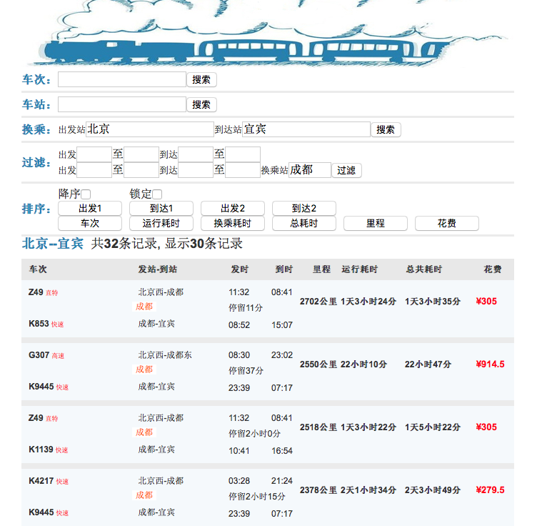

# 小猪火车

背包穷游最大的开销是住宿和交通费。 预算毕竟是有限的，要出去转得久， 转得远， 省钱是关键。铁道交通应该是我国最大众化最经济的出行方式， 如果能把路上花的时间都尽量安排在夜晚， 这样又省了住宿费又省了时间 。



## 使用方法

```
git clone https://github.com/yanglqq/little-pig-train.git
cd little-pig-train
用浏览器打开train.html
```

## 注意

这个小工具不联网，数据来自*data__tickets*文件， 这里面的火车数据不是最新的。在我2012年背包旅游中， 实践已经检验了这个小工具的实用性。

## Acknowledgments
Some code in *common.js* come from the companion code of the book:
[Javascript The Definitive Guide](http://shop.oreilly.com/product/9780596805531.do) written by [David Flanagan](https://github.com/davidflanagan).
I’d like to thank the author.
